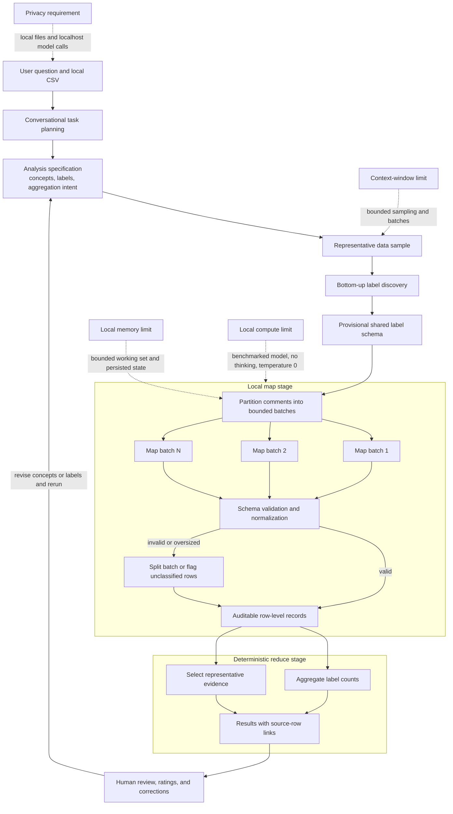

# Local Small-Model Map-Reduce Architecture

## Research Approach

The app treats qualitative analysis as a staged computational workflow rather than one large prompt. A local language model plans the analysis, discovers a controlled label set, and maps bounded batches of comments into structured row-level records. Conventional code then validates and reduces those records into counts and source-linked evidence. This decomposition lets a comparatively small model work within local context, memory, and compute limits while keeping the data on the user's computer.

## Why Map-Reduce Fits Local Models

### Plan and discover

The conversational planning stage converts the user's question into an explicit analysis specification. For concepts whose labels are not known in advance, the model reviews a representative sample rather than loading the entire dataset into one prompt. This produces a provisional, reusable label vocabulary before comment-level analysis begins.

### Map within resource limits

The dataset is partitioned into small batches sized for the local model and machine. Each comment remains an independent unit of analysis, even when several comments share one inference request. The model returns schema-constrained fields for every row. This controls prompt size, bounds the working memory required by each call, supports visible progress, and makes failed batches recoverable.

### Validate before reducing

Model output is checked against a JSON schema, normalized, and restricted to supplied labels where appropriate. Oversized or invalid batches are split. Rows still lacking valid output remain unclassified for human review and do not contribute guessed labels. A conservative request budget reserves context for output; oversized single comments are flagged rather than truncated.

### Reduce without another large prompt

Once row-level records exist, ordinary code performs the main aggregation. Counts and representative comments are derived deterministically and retain their source-row references. The model therefore does not need to reread all comments or fit the full dataset into its context window during reduction.

### Keep humans in the analytical loop

Users inspect original comments, rate usefulness, add notes, and correct row labels. Corrections preserve original model output and immediately recompute counts. Specification edits mark old results stale; reruns archive preceding results. Model configuration, dataset hash, run identifiers, and review events accompany local JSON exports. Feedback does not fine-tune the model.

The app keeps the latest rating as interface state and separately records rating changes and optional notes for review.

## Computational Research Questions

This architecture supports controlled comparison of:

- local model families and sizes;
- batch and sample sizes;
- fixed, user-provided, and bottom-up labels;
- prompt and schema configurations;
- accuracy, label stability, fallback rate, latency, and memory use;
- agreement between model classifications and human review.

The central hypothesis is that explicit decomposition, constrained intermediate records, deterministic reduction, and human verification can make small local models useful for qualitative analysis without requiring the entire dataset to fit into one model context or leave the local environment.
